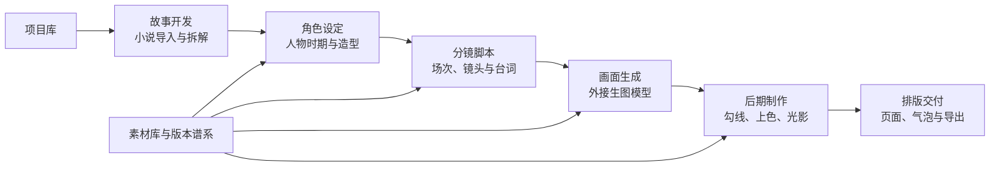
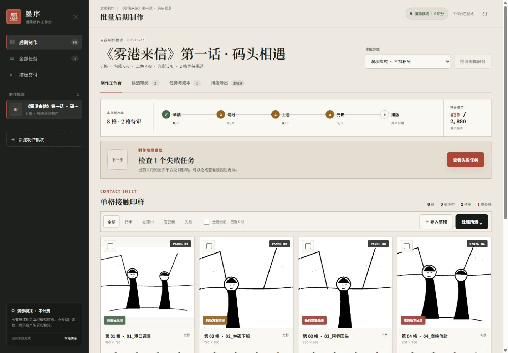
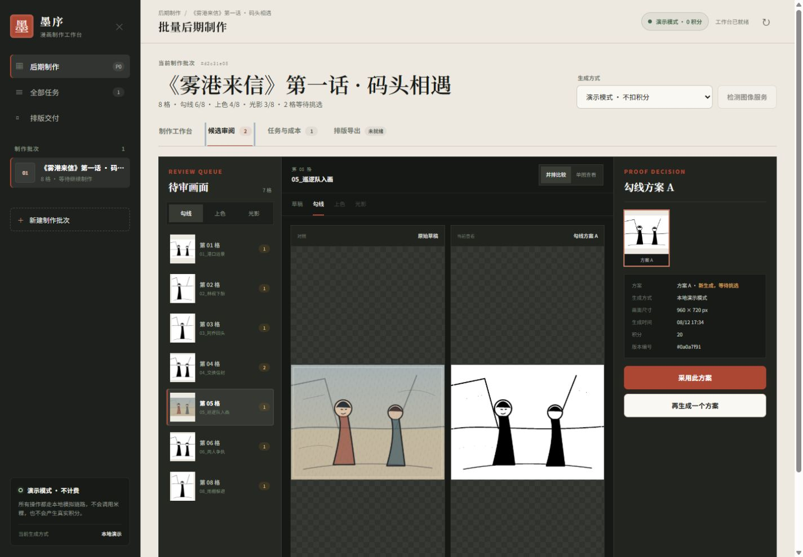
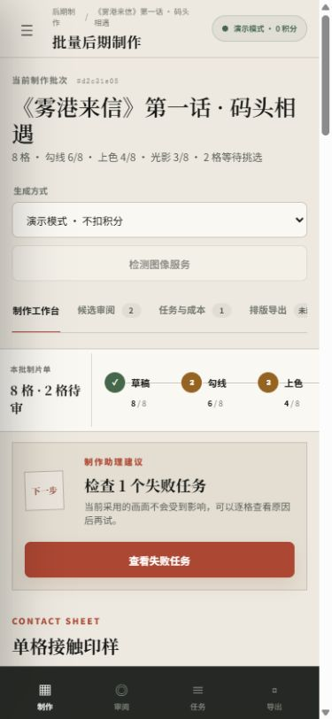

# 旧版前端产品与交互蓝图（历史参考）

> 当前正式界面已切换为 [米粿Studio 单文件棋盘](../public/index.html)。本文保留的是更重型的“批次架/候选审阅”方向，仅作为后续版本管理后台与专业审阅模式的参考，不代表 P0 当前界面。

## 1. 产品前端的总目标

墨序不是“批量调用几个模型的后台”，而是一张可追溯的漫画制片工作台。创作者进入任何页面，都应该能在首屏回答三个问题：

1. 这一话现在做到哪一步？
2. 哪些画面正在等我决定？
3. 我下一次操作会影响什么、消耗多少？

视觉方向采用“编辑部批次架 + 接触印样墙 + 审稿灯箱”，保留米白画纸、深墨侧栏和朱砂校样色。画面预览始终使用完整适配，不裁切漫画格；技术词统一转换成创作者语言。

## 2. 完整产品的信息架构

创作者端最终导航：

- 项目库：作品、卷、话、制作状态与团队待办。
- 故事开发：小说导入、章节拆解、场次、人物关系和世界设定。
- 角色设定：人物基准形象、年龄/时期造型、服装、道具、表情与多视图。
- 分镜脚本：文字分镜、画格节奏、对白、镜头语言和连续性检查。
- 画面生成：草图、线稿生图、参考图、候选方案和批量队列。
- 后期制作：米粿勾线、上色、光影、版本采用与返工。
- 排版交付：页漫/条漫模板、气泡植字、导出和交付快照。
- 素材库：人物、场景、道具、色板、模型输入和完整版本谱系。

管理后台单独进入，避免把平台配置暴露在创作流程中：

- 模型接入：主模型、生图模型、米粿 MCP 的 Base URL、模型名、鉴权方式和连通测试。
- 能力映射：把“故事拆解、人物设定、线稿生成、上色、光影”等产品工序映射到具体模型。
- 任务队列：运行状态、失败归因、幂等键和人工恢复。
- 积分与成本：账户额度、项目预算、预估/确认/待核对费用。
- 成员权限：管理员、制片、主笔、上色、审片和只读访客。
- 操作记录：配置变更、版本采用、导出与费用处理的审计日志。

## 3. 当前 P0 已实现的前端

P0 只开放真正已经接通的能力：制作批次、后期制作、任务与成本、排版导出。未来模块不会以大面积禁用菜单冒充完成品。

### 制作工作台

首屏由五部分组成：

1. 批次身份：批次名、格数和三阶段完成情况。
2. 生成方式：演示模式或米粿正式生成，真实计费状态持续可见。
3. 制片进度：草稿、勾线、上色、光影和排版的采用数量。
4. 制作助理建议：根据失败、待审、处理中和阶段缺口只突出一个下一步。
5. 接触印样墙：画面、阶段点、异常标签、多选和当前最重要操作。

用户可以按“待审、处理中、需更新、失败”筛选，并只对所选漫画格执行工序。批量提交前会先显示可处理格数、跳过格数和预计积分。

### 候选审阅台

候选审阅是核心生产界面：

- 左侧是按工序切换的审阅队列。
- 中间提供原稿/上游与候选的完整画面并排比较。
- 右侧提供方案胶片、采用状态、生成方式、尺寸、时间、积分和版本编号。
- 改用上游方案前，会明确说明哪些下游结果会变成“需更新”。
- 采用稿不会覆盖旧文件，切回匹配的旧上游时，下游可以自动恢复。

P0 保留“再生成一个方案”；圈选问题区域、输入不满意之处并局部重做属于 P1，但入口位置已经确定在审阅台右侧。

### 任务与成本

- 汇总正在处理、失败可处理、积分待核对和累计积分。
- 每次尝试显示漫画格、工序、生成方式、状态、用时、积分和失败说明。
- 只有明确未扣费且输入版本仍一致的失败任务才显示“再试一次”。
- 真实调用结果不确定时，持续显示“积分待核对”，不提供普通重试。

### 排版导出

- 导出前检查光影采用数量、版本不匹配和活动任务。
- P0 固定生成 2400 × 3200 px 的 2×2 页面，不裁切画面。
- 导出是不可变交付快照；采用版本改变后，历史导出仍可查看，但会标记为非最新版。

## 4. 核心交互规则

### 生成方案

1. 用户选择漫画格和工序。
2. 系统计算可处理、跳过和被阻塞的格数。
3. 演示模式显示“0 真实积分”；正式模式显示预估积分和上传授权提示。
4. 用户确认后进入队列，结果作为新方案加入，不覆盖采用稿。
5. 任务完成后进入对应工序的候选审阅队列。

### 采用版本

1. 用户在完整画面上比较候选。
2. 系统计算采用该方案对下游版本的影响。
3. 没有下游影响时直接采用；有影响时显示确认层。
4. 旧文件保留，下游仅标记为“需更新”，不会自动再次生成或扣积分。

### 反馈后再生成（P1）

- 勾线快速意见：线条太粗、线条断裂、五官变形、细节丢失、背景太杂。
- 上色快速意见：人物配色不对、肤色不自然、背景串色、服装区域错误。
- 光影快速意见：光线方向不对、阴影太重、人脸太暗、氛围不符剧情。
- 用户可圈选区域并补充自然语言；系统保存反馈、蒙版、输入版本和参数，形成新的候选分支。

## 5. 响应式与可访问性

- 1280 px 以下：审阅方案信息下移成横向信息层。
- 960 px 以下：批次架变成抽屉，付费/演示模式仍保留在顶部。
- 720 px 以下：漫画格单列，候选审阅改为全屏纵向工作层，底部固定“制作、审阅、任务、导出”。
- 所有关键触摸目标至少 44×44 px。
- 核心正文不小于 12 px；状态同时使用文字、图形和颜色。
- 所有按钮、链接和表单具有可见键盘焦点；减少动态效果设置会关闭位移动画。
- 候选图和导出图统一使用 `object-fit: contain`，禁止因预览布局裁掉画面。

## 6. 后续前端里程碑

### P1：可用的创作反馈闭环

- 圈选局部并描述不满意之处。
- 反馈标签、问题历史和局部重做候选。
- 大图缩放、拖动、像素级前后对比。
- 参数预设、人物参考、色板与场景参考。
- 可编辑排版、对白气泡和基础植字。

### P2：从小说到分镜

- 小说上传、章节/场次拆解和人工确认。
- 人物圣经与时期造型时间线。
- 文字分镜、镜头脚本和分镜草图。
- 外接生图模型生成线稿候选，再交给米粿后期。
- 故事、人物、镜头、画格和图像版本之间的可视化谱系。

### P3：工作室与平台化

- 多人审片、评论、审批和任务指派。
- 项目预算、并发配额和质量评测看板。
- 模型路由、灰度发布、失败降级和供应商成本对账。
- 页漫、条漫和不同投稿平台的交付模板。

## 7. 本轮取舍

- 已经实现的前端只承诺 P0 后端真实具备的能力，不做无效果的反馈输入框或自由排版假按钮。
- 演示数据完全在本地生成；默认不读取外部密钥、不上传画面、不调用米粿。
- 主模型和生图模型 API 管理属于平台后台能力，保留在产品蓝图中，不混进当前内部 P0。
